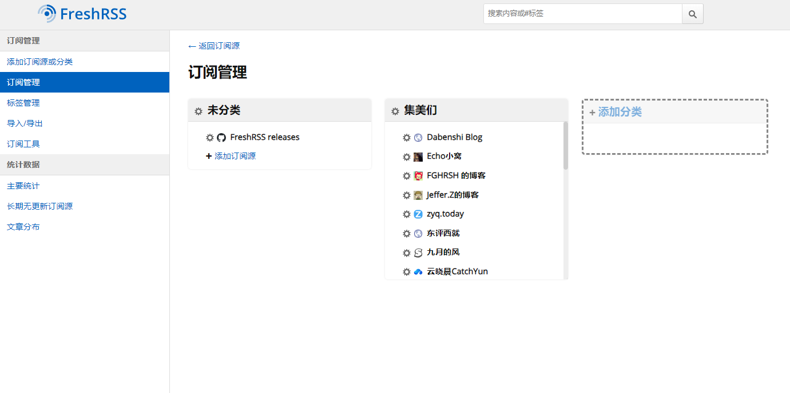
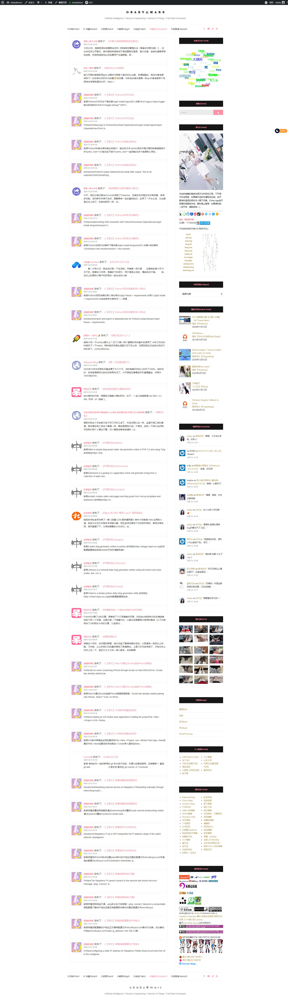
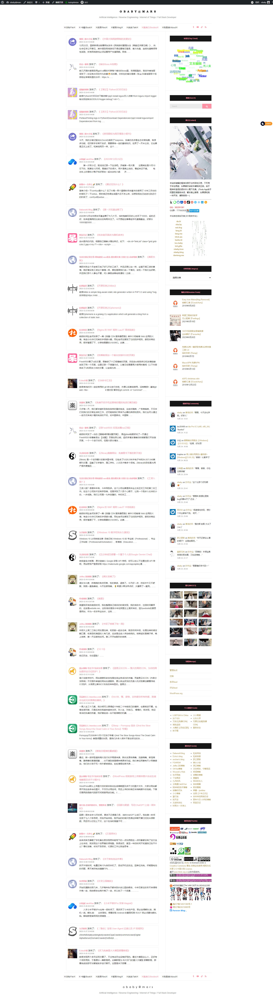

## 基于Freshrss的订阅朋友圈  

-------------
为什么要做这个东西？  
https://h4ck.org.cn/2023/12/14852  

昨天折腾了好久，不知道为什么通过代码拉取到的rss数据始终是缺的。今天早上把cdn的缓存策略调整成全部关闭貌似正常了。  

昨天一天基本白折腾了，最后都开始看rss的api代码了，但是感觉代码貌似也没问题啊。就很奇怪。最终用python实现了一个客户传抓取工具，可以代替php版本。  
相比php版本增加了以下配置参数：  
```python
FRESHRSS_HOST = 'http://freshrss.h4ck.org.cn' #不带最后的/ 服务器地址
USERNAME = 'obaby' #用户名
PASSWD = '1234567890' #api密码，注意是api密码
labels = ['集美们'] # 输出的订阅标签list ，如果在freshrss订阅了其他的不需要同步到博客的数据使用这个标签功能进行过滤
WRITE_TO_FILE_COUNT = 60 # 最后写入到json文件的订阅数量
SUB_MAX_ITEMS_COUNT = 2 # 每个订阅站点最多展示的条目，当然是为了给每个集美流出更多的出现机会啦
JSON_FILE_PATH = '/home/wwwroot/h4ck.org.cn/rss.json' #json文件路径配置，请放到网站目录下，需要与php文件保持一致
```
  
标签功能参考下面的配置：  
  
运行效果：  
```bash
C:\Users\obaby\PycharmProjects\fresrss\baby_rss_client_private.py 
****************************************************************************************************
       _           _             ____                           
  ___ | |__   __ _| |__  _   _  / __ \ _ __ ___   __ _ _ __ ___ 
 / _ \| '_ \ / _` | '_ \| | | |/ / _` | '_ ` _ \ / _` | '__/ __|
| (_) | |_) | (_| | |_) | |_| | | (_| | | | | | | (_| | |  \__ \
 \___/|_.__/ \__,_|_.__/ \__, |\ \__,_|_| |_| |_|\__,_|_|  |___/
                         |___/  \____/                          

FreshRss Clien
Verson: 23.12.24
闺蜜圈：https://dayi.ma
Blog: http://oba.by
欢迎帮姐姐推广闺蜜圈啊
****************************************************************************************************
[*] Login to get token.
[*] Token = obaby/21*******************************576
[*]  ----------------------------------------------------------------------------------------------------
[*] All subscriptions= 26
[*] Selected label subscriptions= 25
[*] Total rss item count= 387
[*] Selected labeled rss item count= 387
[*] Write json to file......
2023-12-24 12:35:00 中国大陆网游限制的发展史
2023-12-24 12:30:00 省份Boss AI绘图
2023-12-24 01:44:00 【笔记】Python3打印日志
2023-12-24 01:44:00 【英文】Python3打印日志
2023-12-23 23:08:00 使用图标为网页增添小细节
2023-12-23 20:25:00 2023年12月小记
2023-12-23 17:42:00 最近在玩什么？
2023-12-23 16:08:00 第一次玩基金赔了
2023-12-23 15:25:00 给友链页面改为随机排序
2023-12-23 11:43:00 离职失败
2023-12-23 02:06:00 开源实例之Miblo
2023-12-23 00:58:00 开源实例之Ephemeris
2023-12-23 00:00:00 Nginx 的 WAF 规则 LuaJIT 高危险版
2023-12-22 13:00:00 给博客添加一个输出友链RSS的页面
2023-12-21 23:18:00 Git命令汇总
2023-12-21 20:52:00 免费开启手机运营商的骚扰电话拦截功能
2023-12-21 16:50:00 用FreshRSS 实现友圈rss订阅
2023-12-21 15:29:00 Zlibrary镜像网站：免费图书下载的新天地
2023-12-21 10:43:00 工资入股？
2023-12-20 00:00:00 Nginx 的 WAF 规则 LuaJIT 中危险版
2023-12-19 19:45:00 Windows 10 数字权利永久激活
2023-12-19 17:43:00 五分钟成功部署一个属于个人的Google Gemini Chat
2023-12-19 13:54:00 闺女发烧了
2023-12-19 12:07:00 揽星
2023-12-18 10:23:00 中招了咳嗽了快一周
2023-12-13 00:00:00 12.13
2023-12-12 11:12:00 蓝易云SCDN — 强大的高防CDN，为你的网站提供全方位防护！
2023-12-12 04:21:00 Vol.69、嘿，废物，去热爱你所有热爱，就像你当初无所畏惧的模样。
2023-12-12 04:20:00 Sleep – Pornopop 选自《And the Slow Songs About the Dead Calm in Your Arms》专辑
2023-12-10 21:11:00 喉咙会哑掉的重感冒
2023-12-10 11:04:00 WordPress 彻底禁用上传媒体图片自动生成缩略图及多尺寸图片
2023-12-09 05:32:00 回顾与展望：写在ChatGPT上线一周年时
2023-12-09 04:42:00 又是两年
2023-12-08 10:00:00 关于换电池这件事
2023-12-03 21:23:00 长安公园晚秋
2023-11-28 20:31:00 小米平板6Pro 安装 Magisk
2023-11-27 23:45:00 「备份」宝塔 User-Agent 过滤以及 IP 段规则
2023-11-25 12:23:00 讯飞免费星火大模型部署教程
2023-11-23 04:07:00 人人都是GPT开发者：如何在10分钟内用GPTs打造你的AI应用
2023-11-14 20:31:00 City walk in 湾里庙步行街
2023-11-12 21:25:00 爱惠浦主滤芯和pp棉更换方法
2023-11-01 23:29:00 小米 14 Pro 16+1T 开箱
2023-10-26 09:25:00 原神，启动！跳转页说明~
2023-10-18 14:37:00 使用DNSSEC预防反诈的DNS劫持？
2023-10-12 11:12:00 证件照尺寸怎么选
2023-10-09 20:23:00 2023年国庆游高中母校
2023-09-01 13:50:00 用ode45做控制系统仿真
2023-06-28 12:09:00 黑龙江-伊春森林公园之行
2023-01-03 21:49:00 FGHRSH 2022 年度报告
2022-10-05 20:56:00 解决wordpress使用阿里CDN后评论无法获取访客真实IP
[*] Write json to file done
[*] Write to file items count= 60
[*] Sub items max count= 2
[*] All finished.
~~~~~~~~~~~~~~~~~~~~~~~~~~~~~~~~~~~~~~~~~~~~~~~~~~~~~~~~~~~~~~~~~~~~~~~~~~~~~~~~~~~~~~~~~~~~~~~~~~~~~~~~~~~~~~~~~~~~~~~~~~~~~~~~~~~~~~~~~~~~~~~~~~~~~~~~~~~~~~~~~~~~~~~~~~~~~~~~~~~~~~~~~~~~~~~~~~~~~~~~

```
  
  
使用前通过pip install -r requriments.txt 安装依赖库  
好啦，最终就是这样的，原php代码网站展示效果：  
  
python代码效果：  
  


ps:  
如果通过venv写sh运行定时任务可能会出现下面的错误：  
sh内容：  
```shell
cd 
source venv/bin/activate
python baby_rss_client_private.py
```
```shell
obaby@h4ck:~/freshrss$ sh client.sh
client.sh: 2: source: not found
client.sh: 3: python: not found

```
通过sudo dpkg-reconfigure dash 命令修改默认的sh处理器，选择no：  
```shell
obaby@h4ck:~/freshrss$ sudo dpkg-reconfigure dash
[sudo] password for obaby:
Removing 'diversion of /bin/sh to /bin/sh.distrib by dash'
Adding 'diversion of /bin/sh to /bin/sh.distrib by bash'
Removing 'diversion of /usr/share/man/man1/sh.1.gz to /usr/share/man/man1/sh.distrib.1.gz by dash'
Adding 'diversion of /usr/share/man/man1/sh.1.gz to /usr/share/man/man1/sh.distrib.1.gz by bash'

```
好啦，就到这里啦：  
```bash
****************************************************************************************************
       _           _             ____                           
  ___ | |__   __ _| |__  _   _  / __ \ _ __ ___   __ _ _ __ ___ 
 / _ \| '_ \ / _` | '_ \| | | |/ / _` | '_ ` _ \ / _` | '__/ __|
| (_) | |_) | (_| | |_) | |_| | | (_| | | | | | | (_| | |  \__ \
 \___/|_.__/ \__,_|_.__/ \__, |\ \__,_|_| |_| |_|\__,_|_|  |___/
                         |___/  \____/                          

FreshRss Clien
Verson: 23.12.24
闺蜜圈：https://dayi.ma
Blog: http://oba.by
欢迎帮姐姐推广闺蜜圈啊
****************************************************************************************************
```
